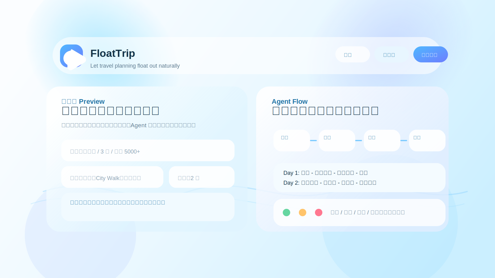

# FloatTrip

FloatTrip 是一个旅游规划 Agent 项目，目标是让旅行规划像水面一样自然浮动出来，让用户获得轻松、顺滑、一键生成行程的体验。

## 项目愿景

- 用 Agent 编排把“旅行需求”转成“可执行行程”
- 前端走现代柔和的水面感设计
- 入口区分官网、用户工作台和后台管理台

## 站点入口

- 官网前台：`www.floattrip.com`
- 用户工作台：`app.floattrip.com`
- 后台管理台：`admin.floattrip.com`

## 当前内容

- 旅游规划产品 PRD
- 首页和规划页前端原型
- 示例预览页
- 旅行信息搜索工具

## 示例图片

## 设计关键词

- 淡蓝渐变
- 悬浮玻璃感
- 弱分割线
- 强交互动效
- 平静水面氛围

## 本地预览

当前仓库主要是静态原型文件，可以直接打开这些页面查看效果：

- `static/docs/preview.html`
- `static/docs/indexv1.html`
- `static/docs/plannerv1.html`

## 技术栈

- Agent 编排：LangGraph / LangChain
- Agent 测试与迭代：LangSmith

## 目录说明

- `static/docs/`：前端原型与产品文档
- `tools/`：旅行信息辅助工具
- `assets/`：README 示例图等静态素材

## 说明

这个仓库目前以产品原型和设计说明为主，后续可以继续补充：

- 真实前端应用
- Agent 编排代码
- 接口层与数据层
- 更完整的测试与部署配置
