<div align="center">

# ✈️ 途见 · FloatTrip

### 记住旅行偏好，从一句话走到可执行行程

途见会在对话中理解目的地、日期与真实约束，把你确认过的旅行习惯带进下一次规划，
再用 LangGraph 多 Agent、天气和高德真实 POI 生成可追踪、可编辑的完整路线。

[](https://www.python.org/)
[](https://fastapi.tiangolo.com/)
[](https://github.com/langchain-ai/langgraph)
[](https://lbs.amap.com/)
[](tests/EVAL_GUIDE.md)
[](LICENSE)

[项目介绍](docs/project-introduction.md) · [项目图集](#project-gallery) · [产品演示](#demo) · [移动端 App](#mobile-app) · [快速开始](#quick-start) · [系统架构](#architecture) · [评测体系](#evaluation)

</div>

---

## ✨ 为什么是途见

大多数旅行规划工具只记得当前的一句话。途见把一次旅行拆成可理解、可确认、可恢复的过程：

- 🧠 **长期旅行记忆** — 从已归档对话中提取可追溯的偏好与避雷项；用户可以审批、编辑、忘记，并为单次旅行临时覆盖。
- 💬 **先对话，再开跑** — 多轮澄清后生成结构化 Planning Brief；目的地、日期和记忆投影都清楚展示，只有明确确认才启动正式规划。
- 🗺️ **真实地点与可执行路线** — 景点、餐厅来自高德 POI，结合天气、开放时间、地理聚类和 Planner ⇄ Reviewer 多轮优化。
- ⚡ **离开页面也会继续** — Chat 与规划使用持久化 Run，支持排队、SSE 回放、取消、重试、断线恢复和需要用户确认时暂停。
- ✍️ **结果不是一次性答案** — 行程支持地图动线、拖拽换序、换点、改时段、撤销重做、路线优化和服务端距离重算。
- 🧪 **质量可以量化** — 内置代码打分器、LLM 评委、Reviewer 可靠性和 pass@k / pass^k 指标，而不只依赖主观观感。

所有景点与餐厅数据均来自**高德真实 POI**；长期记忆具有来源、作用域和审计记录，不会在用户不知情的情况下静默覆盖当前需求。

> 完整 Agent 评测方法、指标与运行方式见 [`tests/EVAL_GUIDE.md`](tests/EVAL_GUIDE.md)。

---

<a id="project-gallery"></a>

## 🖼️ 六张图认识 FloatTrip

从旅行规划的真实痛点，到 Multi-Agent 职责分工、可控旅行记忆、地图行程与开源协作：

<table>
  <tr>
    <td width="33.33%" valign="top">
      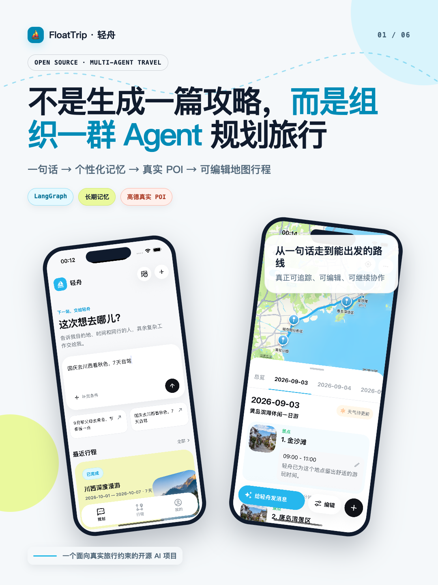
      <p align="center"><b>不是生成攻略，而是组织 Agent 规划旅行</b></p>
    </td>
    <td width="33.33%" valign="top">
      
      <p align="center"><b>为什么需要 Multi-Agent</b></p>
    </td>
    <td width="33.33%" valign="top">
      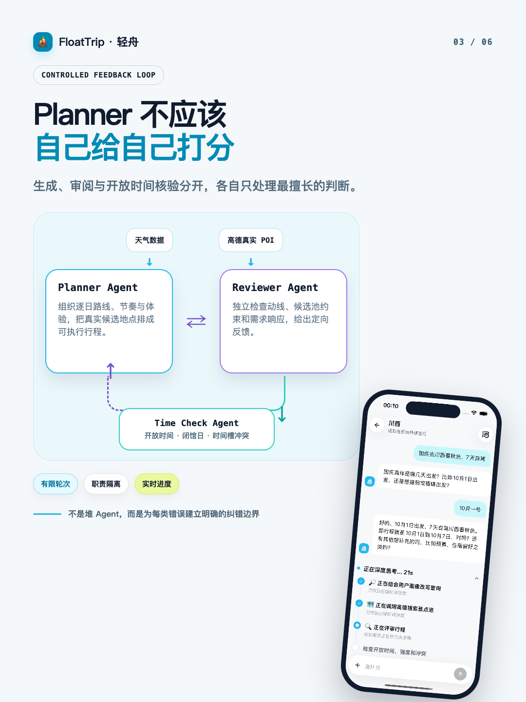
      <p align="center"><b>生成、审阅与时间核验分工协作</b></p>
    </td>
  </tr>
  <tr>
    <td width="33.33%" valign="top">
      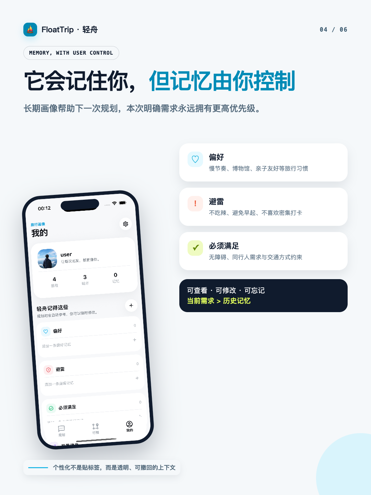
      <p align="center"><b>记住偏好，但记忆始终由用户控制</b></p>
    </td>
    <td width="33.33%" valign="top">
      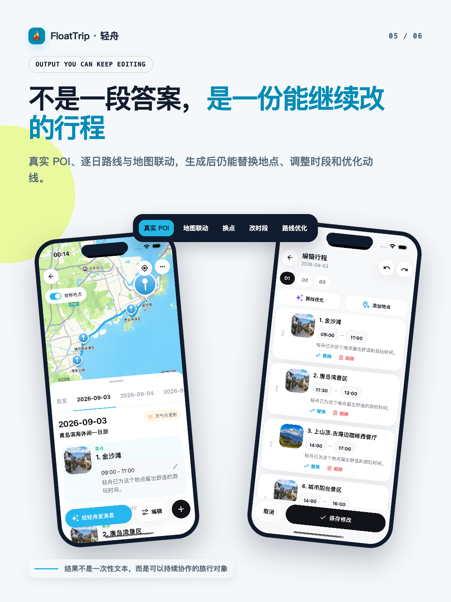
      <p align="center"><b>真实 POI、地图联动与持续编辑</b></p>
    </td>
    <td width="33.33%" valign="top">
      <a href="https://github.com/shouzhuoshouzhuo/FloatTrip">
        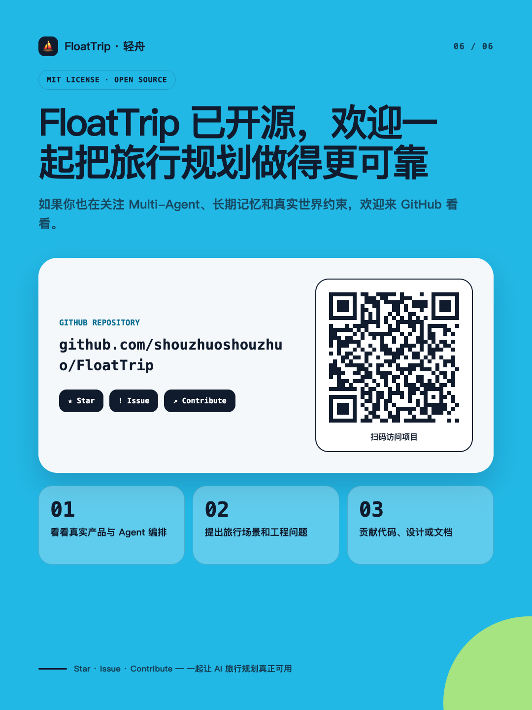
      </a>
      <p align="center"><b>欢迎 Star、提 Issue 与参与贡献</b></p>
    </td>
  </tr>
</table>

> 喜欢这个方向？欢迎为 [FloatTrip 点亮 Star](https://github.com/shouzhuoshouzhuo/FloatTrip)、提交 [Issue](https://github.com/shouzhuoshouzhuo/FloatTrip/issues)，或通过 [Pull Request](https://github.com/shouzhuoshouzhuo/FloatTrip/pulls) 参与贡献。

---

<a id="demo"></a>

## 🎬 产品演示

### 1. 对话生成 Planning Brief，长期记忆透明可控

目的地与日期会被结构化展示；本次带入的长期记忆注明来源和作用方式，也可以只为当前旅行临时覆盖。

<p align="center">
  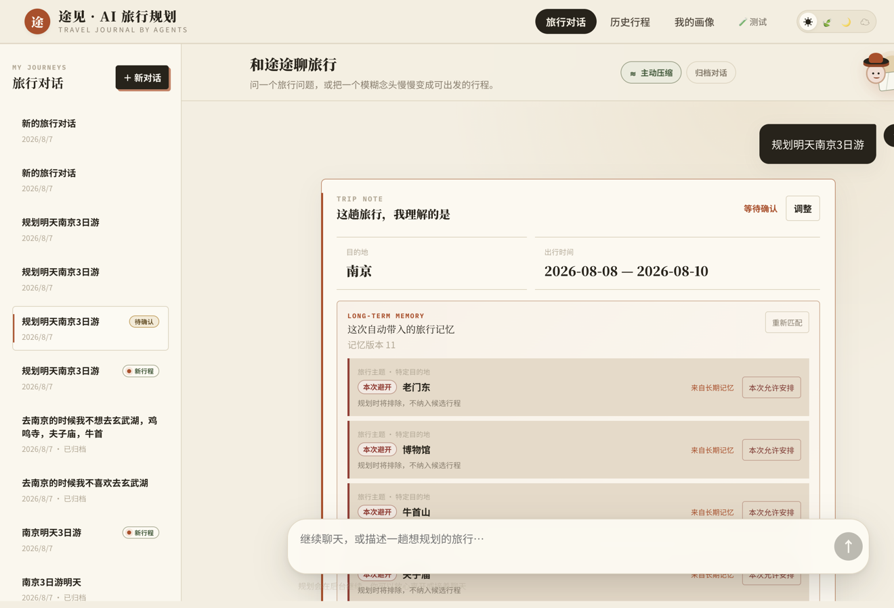
</p>

<table>
  <tr>
    <td width="50%" valign="top">
      <h3>2. 天气、真实 POI 与地图动线</h3>
      <p>逐日天气、候选景点、时间表和地图路线在同一视图中联动，结果可以继续编辑和优化。</p>
      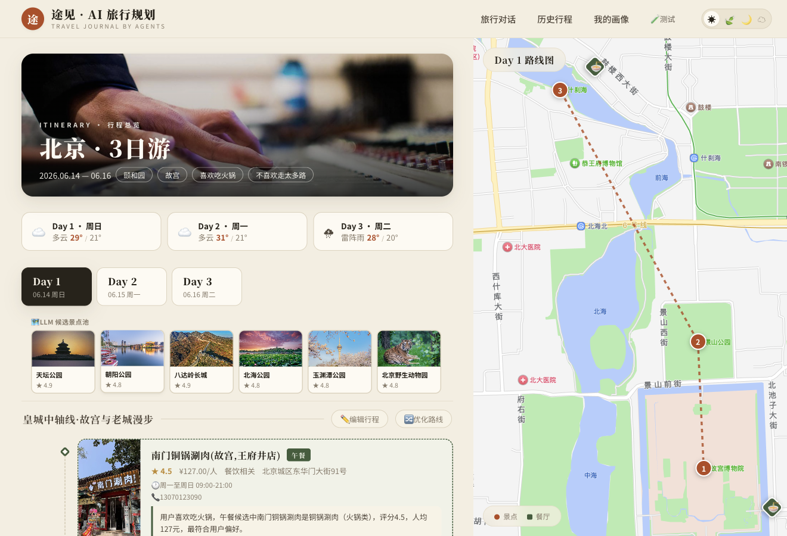
    </td>
    <td width="50%" valign="top">
      <h3>3. 旅行画像不是黑盒</h3>
      <p>记忆按类型和作用域管理，保留来源与版本；用户始终可以新增、编辑或忘记。</p>
      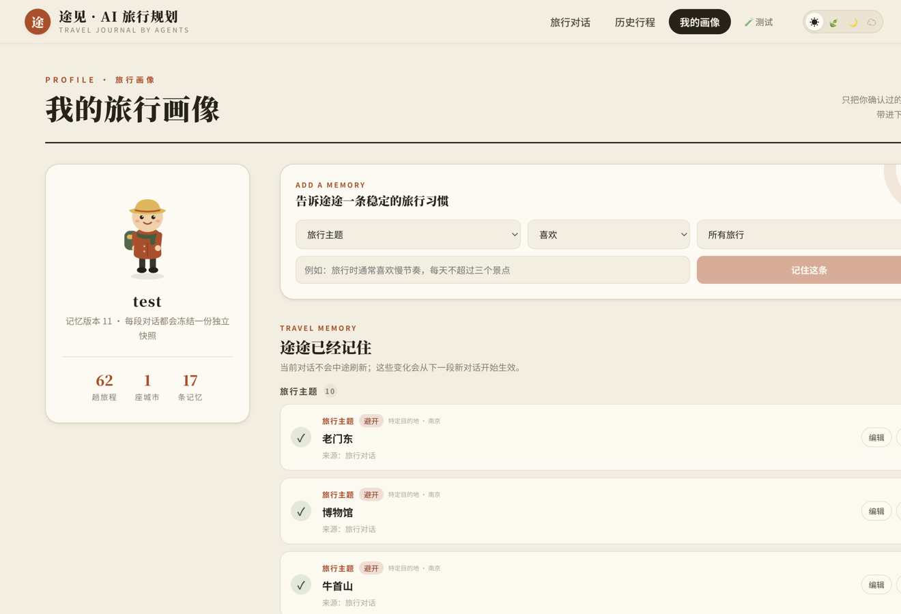
    </td>
  </tr>
</table>

---

<a id="mobile-app"></a>

## 📱 轻舟移动端 App

`mobile-app/` 是与本项目 FastAPI 服务直接联调的 Bare React Native 客户端（iOS / Android）。它不是 Web 的静态壳：登录、对话、Planning Brief、持久化 Run、SSE 进度、行程编辑和旅行画像都复用同一套后端协议。

- **自然语言规划**：一句话描述目的地、日期和同行人；对话会补齐必要条件，生成可确认的 Planning Brief。
- **真实后端进度**：规划任务通过可恢复的 SSE Run 推送；客户端按后端 `planning_run.progress` 阶段展示理解需求、搜集地点、编排行程、核查冲突与完善细节。
- **地图与行程编辑**：iOS 优先使用高德原生地图；未接入厂商二进制的模拟器自动使用 Apple MapKit。地点、路线、日期和底部行程卡联动，支持编辑、优化、撤销和重做。
- **旅行画像**：偏好、避雷和必须满足的条件可随时维护，并在下一次规划中透明地带入。
- **离线演示模式**：服务不可用时可进入本地演示，方便体验完整界面和交互。

<table>
  <tr>
    <td width="33.33%" valign="top">
      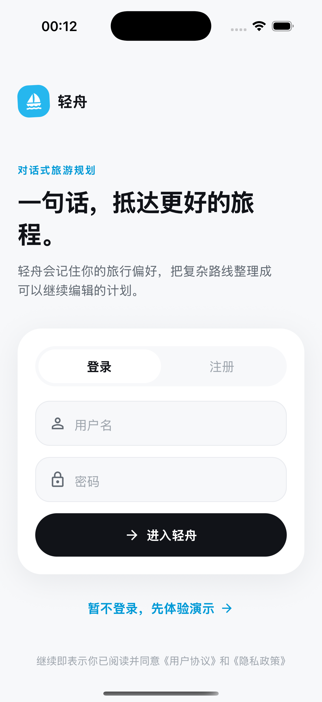
      <p align="center"><b>登录与演示入口</b></p>
    </td>
    <td width="33.33%" valign="top">
      
      <p align="center"><b>一句话开始旅行规划</b></p>
    </td>
    <td width="33.33%" valign="top">
      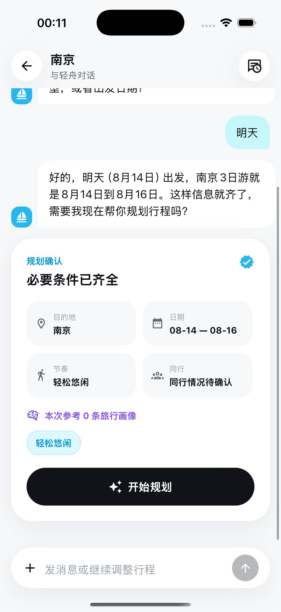
      <p align="center"><b>结构化确认出行条件</b></p>
    </td>
  </tr>
  <tr>
    <td width="33.33%" valign="top">
      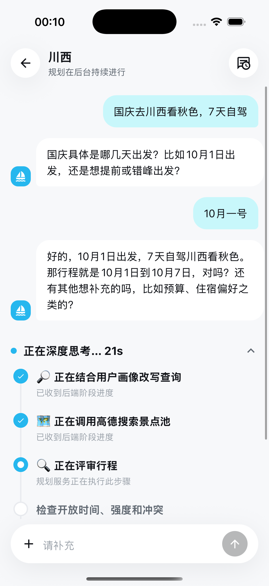
      <p align="center"><b>后端 SSE 实时规划进度</b></p>
    </td>
    <td width="33.33%" valign="top">
      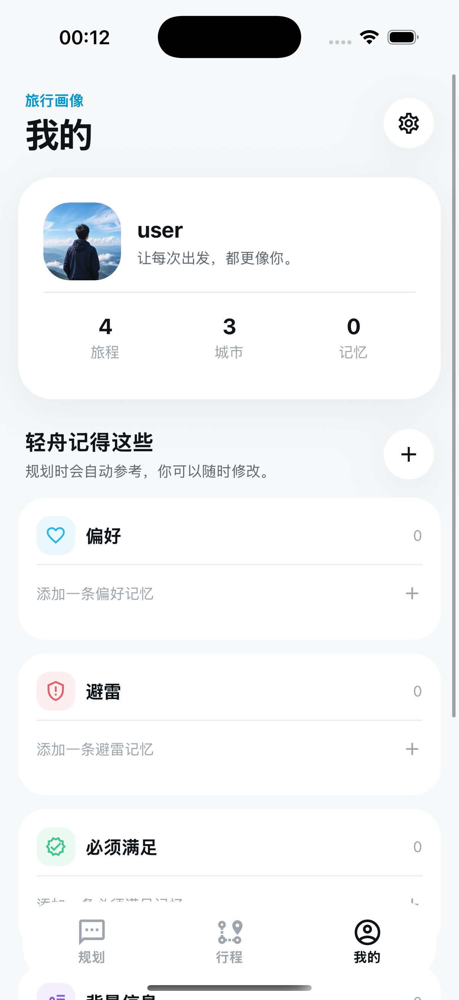
      <p align="center"><b>可管理的旅行画像</b></p>
    </td>
    <td width="33.33%" valign="top">
      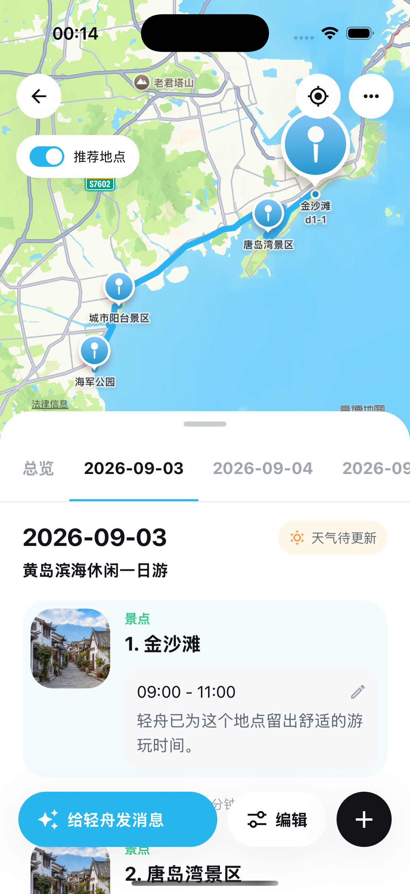
      <p align="center"><b>地图联动的可编辑行程</b></p>
    </td>
  </tr>
  <tr>
    <td width="33.33%" valign="top">
      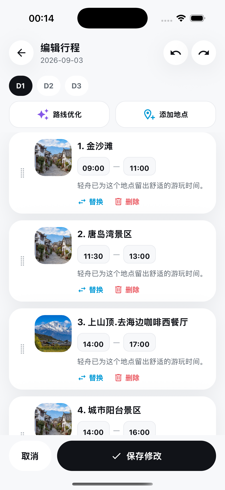
      <p align="center"><b>路线优化、替换地点与保存修改</b></p>
    </td>
  </tr>
</table>

### 运行移动端

需要 Node.js 22、Xcode（iOS）或 Android Studio（Android）。先在仓库根目录启动后端，再启动移动端：

```bash
# 仓库根目录：启动 FastAPI
./.venv/bin/uvicorn app.main:app --reload --port 8000

# 新终端：安装并运行 App
cd mobile-app
npm ci
npm run ios       # 或 npm run android
```

移动端包含 Jest 单测、类型检查、Lint 和 Maestro UI 流程；详细配置、地图 Key 与真机构建说明见 [`mobile-app/README.md`](mobile-app/README.md)。


---

<a id="architecture"></a>

## 🏗️ 系统架构

```
旅行对话 ──→ [LLM 对话理解] ──→ [Planning Brief]
   │                │                   │
   │                └── 冻结对话记忆     ├── 动态旅行约束
   │                                     └── 长期记忆投影 / 单次覆盖
   │
   └── 用户明确确认 ──→ [持久化 Planning Run / SSE 回放]
                              │
                              ▼
                       [Intent + Query Rewrite]
                              │
                              ▼
                  [天气 + 高德 POI + 地理聚类]
                              │
                              ▼
                  [Planner Agent ⇄ Reviewer Agent]
                              │
                              ▼
                 [Time Check ⇄ Planner 定向修正]
                              │
                              ▼
                   [周边餐饮 + Meal Recommend]
                              │
                              ▼
        [Finalize] → 时刻表 + 餐厅 + 距离 + 地图 + 约束说明
```

Chat 和正式规划分别使用独立并发容量；同一会话的 Chat 串行，同一基础行程的修改串行。
Run 的生命周期、进度、交互请求与结果均会持久化，客户端可通过 SSE 在断线后继续回放事件。详见
[`docs/agent-runtime.md`](docs/agent-runtime.md) 与
[`docs/conversation-entry-migration.md`](docs/conversation-entry-migration.md)。

**修改规划（迷你图）**：用户对已有行程提修改意见时，跳过 Intent/景点搜索，从上次规划的 checkpoint 恢复状态，只跑 `Planner ⇄ Reviewer（最多 2 轮）→ 餐饮 → Finalize`，Reviewer 验证 Planner 是否真正响应了修改意见（修改流程不接入 Time Check）。

**技术栈**


| 层        | 技术                                |
| -------- | --------------------------------- |
| 后端框架     | FastAPI + Uvicorn                 |
| Agent 编排 | LangGraph                         |
| LLM      | DeepSeek / 豆包（`LLM_PROVIDER` 切换，LangChain OpenAI 兼容层） |
| 地图数据     | 高德地图 Web 服务 API                   |
| 前端       | JSX 组件化单页（无构建，浏览器内 Babel）         |
| 移动端     | Bare React Native 0.86 + TypeScript + Fabric（iOS / Android） |


---

<a id="quick-start"></a>

## 🚀 快速开始

### 1. 克隆仓库

```bash
git clone https://github.com/shouzhuoshouzhuo/FloatTrip.git
cd FloatTrip
```

### 2. 安装依赖

```bash
pip install -r requirements.txt
```

### 3. 配置环境变量

```bash
cp .env.example .env.local
```

编辑 `.env.local`，填入你的 API Key：

```env
AMAP_API_KEY=your_amap_key             # 高德 Web 服务 Key（必填，景点/天气）
LLM_PROVIDER=deepseek                  # LLM 提供商（可选，deepseek/doubao，默认 deepseek）
DEEPSEEK_API_KEY=your_deepseek_key     # DeepSeek API Key（用 deepseek 时必填）
DOUBAO_API_KEY=your_doubao_endpoint    # 豆包 endpoint ID（用 doubao 时必填）
AMAP_JS_KEY=your_amap_js_key           # 高德 JS API Key（可选，前端地图）
AMAP_JS_SECURITY_CODE=your_js_secret   # 高德 JS API 安全密钥（可选，与 JS Key 配套）
REDIS_URL=redis://localhost:6379/0     # Redis 缓存（可选，不填则跳过缓存，不影响功能）
RUNTIME_CHAT_CONCURRENCY=8             # Chat Run 并发上限（可选）
RUNTIME_PLANNING_CONCURRENCY=2         # 正式规划 / 修改的全局并发上限（可选）
RUNTIME_PLANNING_PER_USER=2            # 单用户正式规划 / 修改并发上限（可选）
RUNTIME_LLM_CONCURRENCY=8              # LLM 调用并发容量（可选）
RUNTIME_AMAP_CONCURRENCY=8             # 高德调用并发容量（可选）
RUNTIME_CHECKPOINT_DB=data/langgraph-checkpoints.db  # LangGraph checkpoint 文件（可选）
```

> 多 LLM 提供商的详细配置、切换方式与故障排查见 [`LLM_PROVIDERS.md`](LLM_PROVIDERS.md)。

> **如何获取 Key？**
>
> - 高德 Web 服务 Key：登录 [高德开放平台](https://lbs.amap.com/) → 控制台 → 创建应用 → 添加 **Web 服务** Key
> - 高德 JS API Key：同一应用下再添加一个 **Web 端 (JS API)** Key，并配置安全密钥 `securityJsCode`（前端地图可视化用，不填则地图区域降级提示）
> - DeepSeek Key：登录 [DeepSeek 开放平台](https://platform.deepseek.com/) → API Keys

### 4. （可选）启动 Redis

如需启用缓存，先启动 Redis，再配置 `REDIS_URL`：

```bash
# macOS
brew install redis && brew services start redis

# Docker
docker run -d -p 6379:6379 redis:alpine
```

不启动也完全可以正常使用，缓存功能会自动跳过。

### 5. 启动服务

```bash
python run.py
```

打开浏览器访问 **[http://localhost:8765](http://localhost:8765)**，输入出行需求即可。

---

## 📁 项目结构

```
├── app/
│   ├── core/          # 环境变量加载、HTTP 工具、Redis 缓存层、SQLite、记忆、鉴权
│   ├── api/           # HTTP/SSE 路由（含 conversations、runs 和运行指标）
│   ├── chat/          # 对话 Agent、对话图与规划简报服务
│   ├── llm/           # LLM 工厂：factory.py（按 LLM_PROVIDER 分发）+ deepseek.py / doubao.py
│   ├── providers/
│   │   ├── amap/      # 高德地图 POI 搜索
│   │   └── weather/   # 高德天气预报
│   └── planning/
│       ├── schemas.py  # Pydantic 数据模型 & LangGraph 状态
│       ├── nodes.py    # 各 Agent 节点函数
│       ├── graph.py    # LangGraph 图构建与流水线入口
│       ├── helpers.py  # 纯工具函数（地理计算、评审预检等）
│       └── prompts.py  # 所有 LLM System Prompt
│   └── runtime/        # Run 调度、持久化、事件流、恢复与可观测性
├── tests/
│   ├── EVAL_GUIDE.md              # 评估框架使用手册
│   ├── eval/                      # Planner/Reviewer 评估框架
│   │   ├── harness.py             # fixture → TravelPlanState → mini-graph
│   │   ├── run_eval.py            # 主入口：加载用例 → k 次评估 → 报告
│   │   ├── report.py              # 指标聚合与 Markdown 报告
│   │   ├── capture_pool.py        # 调高德 API 抓真实景点池骨架
│   │   ├── generate_fixtures.py   # 批量生成测试 fixture
│   │   └── graders/
│   │       ├── code_graders.py    # G1–G7 确定性代码打分器
│   │       ├── llm_judge.py       # LLM 评委（主观维度打分）
│   │       └── reviewer_reliability.py  # Reviewer 可靠性 + Planner 反驳率
│   ├── eval_query_rewrite/        # query_rewrite 节点专项评估
│   │   ├── fixtures.py            # 5 个测试场景（补全/冲突/不发明）
│   │   ├── harness.py             # 直接读 DB + 单次 LLM 调用 + 确定性打分
│   │   └── run_eval.py            # 评估入口：--only / --k / --out
│   └── test_weather_mock.py       # 雨天 mock 冒烟测试
├── frontend/          # JSX 组件化单页（main/pages/components/mascot/tweaks-panel/edit/api）
├── mobile-app/        # React Native 移动端（iOS / Android、原生地图、SSE、Maestro）
├── mobile-prototype/  # 移动端交互原型与视觉测试
├── static/images/readme/mobile/ # App README 截图
├── run.py             # 启动入口
└── .env.example       # 环境变量模板
```

---

## 🔑 设计亮点

**1. 候选池封闭世界约束**
所有景点必须来自高德 API 搜索结果，LLM 不得凭空生成景点名。Reviewer Agent 有硬性检查，出现非候选池景点直接打回重规划。

**2. 代码评审 + LLM 评审分层**
Reviewer 的判断依据由 Python 预先计算（每天地理跨度、开放时间冲突检测），以客观事实形式喂给 LLM，避免纯 LLM 评审的幻觉风险。

**3. Planner-Reviewer 共享对话记忆**
每轮规划双方各追加一条记录到 `planner_reviewer_dialogue`。Reviewer 凭此记住自己上轮标注的【紧急必须优先改】是否已被响应，避免每轮从零审视导致的低效循环；Planner 也能对照哪些意见已修复、哪些紧急问题仍待解决。

**4. 天气感知路线规划**
Intent 阶段自动拉取高德天气预报（复用已有 `AMAP_API_KEY`），将天气信息注入 Planner 和 Reviewer 的 prompt。雨雪天 Planner 会优先安排博物馆、展馆等室内景点，Reviewer 也会检查路线是否与天气矛盾并打回修改。超出预报范围（约 4 天）时降级提示，不中断规划流程。

**5. 餐饮推荐按天并行 + 确定性降级**
将原本"所有天一次 LLM 调用"改为每天独立调用（`SingleDayMealPick`，4 字段），不同天用线程池并行执行，单天 LLM 失败时自动降级取评分最高餐厅，不影响其他天，彻底消除因 prompt 过长导致的 500 错误。

**6. 结构化输出防护**
所有 LLM 调用通过 `invoke_structured` 包装，对 DeepSeek function calling 偶发返回 `None` 的情况自动重试，保证流水线稳定。

**7. 前端地图动线可视化**
后端通过 `GET /api/config` 仅向前端下发高德 **JS API** 密钥（不暴露敏感的 REST `AMAP_API_KEY`），前端按天用高德地图绘制景点标注与连线动线，地图占据半屏，未配置 JS Key 时地图区域降级为友好提示，不影响行程文本展示。

**8. Time Check 专项 Agent（开放时间二次修正循环）**
主流程 Planner-Reviewer 循环结束后，新增 `time_check` 节点专门核查每个景点的安排时段是否与开放时间/闭馆日冲突。它使用 CoT 推理（先写完整逐景点推理过程，再从结论中筛选违规），输出定向修正指令交给 Planner 修正，最多循环 `max_time_check_rounds` 轮（默认 3）。开放时间问题完全由该 Agent 处理，Reviewer 不再涉及，避免双重干预震荡。

**9. Reviewer 职责精简 + 友好提醒机制**
Reviewer 不再负责开放时间检查（交给 Time Check）。`RouteReview` schema 拆成两个输出字段：`route_modify_opinion`（技术诊断，给 Planner 看）和 `issues`（友好出行提醒，给用户看，禁止"违规/冲突"等批判词）。`day_proximity_report` 增加跨天中心间距计算，不足 5km 时自动标注⚠️，客观检测多天行程在同一区域反复横跳的问题。

**10. Redis 缓存层（可选，优雅降级）**
高德天气（TTL=4h）和 POI 搜索（TTL=12h）结果自动写入 Redis，重复请求直接命中缓存。`REDIS_URL` 未配置或 Redis 不可用时，`cache.py` 静默降级为透传，整个功能无任何副作用，不影响主流程稳定性。

**11. 路线优化（暴力枚举最短路径）**
规划完成后，用户可对任意一天点击"优化路线"：后端枚举 daytime 景点全排列，**路程目标只计算景点（daytime + evening）之间的 haversine 距离，餐厅不参与评分**（避免被就餐点位置干扰真实游玩动线），evening 景点固定末位，重算每段 `dist_from_prev_km` 并时间槽顺序对齐后写回 DB。原始排列也在候选内，保证 `best_km ≤ original_km`；若优化距离与原始差距 < 0.05 km 则标记 `improved=false`。支持一键回退到 Agent 原始顺序（`POST /api/plan/revert_day`），前端在首次优化时保存原始 timeline 快照，确保回退数据准确。

**12. 地理分区聚类（替代坐标盲的行政区名）**
喂给 Planner/Reviewer 的候选池不再只标行政区名（adname）——同一行政区的景点可能相距很远（如玄武湖与中山陵同属玄武区却约 10km）。`cluster_pois_by_location` 用真实经纬度做确定性 k-means（按出行天数定 k，固定种子初始化保证可复现），把候选池按『📍地理分区』分组展示，并在 prompt 中明确"行政区相同不代表距离近，以地理分区为准"，引导模型把同区景点排进同一天、减少跨城横跳。

**13. 手动编辑行程（拖拽 / 换点 / 改时段 + 服务端重算）**
生成的行程支持进入编辑态手动调整：SortableJS 拖拽换序（时段留在位置上不跟卡走）、调起高德搜索弹层更换或新增景点/餐厅（`GET /api/poi/search` 代理，入参清洗 + 长度限制）、直接编辑每段时间，带完整撤销/重做栈与 `beforeunload` 离开守卫。保存走 `PUT /api/plan/{id}/timeline`，**服务端按 haversine 重算每段 `dist_from_prev_km` 为准**（前端实时显示用同公式但不落库），并对残缺 location 做防御避免 KeyError。

**14. 偏好占位垃圾值清洗**
LLM 在用户未提供偏好时偶尔吐出 `null`/`none`/`无`/`不限` 等占位垃圾值。`clean_pref` 仅在『整串』等于垃圾 token 时归一为"无偏好"（None），避免误伤"无辣不欢"这类正常偏好，统一作用于 intent 抽取与 query_rewrite 输出。

**15. 持久化 Agent Runtime**
对话和规划不再依赖单个 HTTP 请求的生命周期。Runtime 为每次操作创建持久化 Run：容量不足时安全排队，运行状态、进度、错误、交互请求和最终结果可查询并通过 SSE 回放；支持取消、重试和 LangGraph interrupt 恢复。当前实现适用于单节点部署，多节点部署边界见 [`docs/agent-runtime.md`](docs/agent-runtime.md)。

---

<a id="evaluation"></a>

## 🧪 评测体系

> **为什么信任这个系统的输出质量？**

本项目参照 Anthropic《Demystifying Evals for AI Agents》的方法论，对 Planner 和 Reviewer 两个核心 Agent 建立了一套**可复现的定量评估框架**。

### 评估设计

```
冻结输入（fixture）           真实 LLM 调用
 景点池 + 天气              Planner ⇄ Reviewer
    │                            │
    └──── mini-graph ────────────┘
                │
           最终 route
                │
     ┌──────────┴──────────┐
     ▼                     ▼
代码打分器 G1–G7        LLM 评委（主观维度）
（确定性，零 LLM 成本）   （偏好/节奏/天气适配）
```

- **输入冻结**：每个测试用例（fixture）冻结了景点候选池和天气，跳过 intent / 高德搜索，使评估可复现、零额外 API 成本
- **代码打分器 G1–G7**：复用代码（`helpers.py`）对最终路线做确定性校验，涵盖封闭池、开放时间、地理跨度、结构合法性、天气合规等
- **LLM 评委**：对主观质量（偏好贴合、节奏、动线连贯、天气应对策略）打 1–5 分
- **Reviewer 可靠性**：统计误放行率（放过坏方案）和误打回率（拒绝好方案），量化 Reviewer Agent 本身的判断质量
- **Planner 反驳率**：逐轮分析 Planner 对 Reviewer 意见的响应（采纳 / 反驳 / 忽略），忽略率高是 pass 率低的强信号

### 核心指标

| 指标 | 含义 |
|---|---|
| **pass@k** | k 次中≥1 次客观通过且收敛（能力下界） |
| **pass^k** | k 次全部通过（稳定性） |
| **轮次均值** | 平均用几轮收敛，目标 ≤ 3 |
| **误放行率** | Reviewer 放过不合格方案的概率，理想接近 0% |
| **忽略率** | Planner 对 Reviewer 意见不改也不解释，越低越好 |

### 快速运行

```bash
# 单用例冒烟（不调 LLM 评委，省钱）
python -m tests.eval.run_eval --only nanjing-3d-sunny-history --k 1 --no-judge

# 标准评估（k=5，输出 Markdown 报告）
python -m tests.eval.run_eval --k 5 --out eval_report.md
```

详细说明见 [`tests/EVAL_GUIDE.md`](tests/EVAL_GUIDE.md)。

### query_rewrite 节点专项评估

针对 `query_rewrite` 节点的行为验证，独立于 Planner/Reviewer 评估框架，位于 `tests/eval_query_rewrite/`。

**测试的三个核心行为：**

| 指标 | 含义 |
|---|---|
| **g_supplement** | query 无偏好时，应从历史画像补全对应字段 |
| **g_conflict** | query 与画像冲突时（如"不吃辣" vs 画像"辣味美食"），以 query 为准 |
| **g_no_invention** | query 和画像均无偏好时，三字段应为 null，不凭空编造 |

**5 个 fixture 覆盖场景：**`no-pref-supplement` / `conflict-food-query-wins` / `partial-merge` / `empty-profile` / `no-pref-both`

```bash
# 单用例冒烟（最快）
python -m tests.eval_query_rewrite.run_eval --only conflict-food-query-wins

# 全量 5 用例
python -m tests.eval_query_rewrite.run_eval

# 稳定性（每用例跑 3 次）
python -m tests.eval_query_rewrite.run_eval --k 3 --out qr_eval_report.md
```

---

## 📄 License

[MIT](LICENSE)
