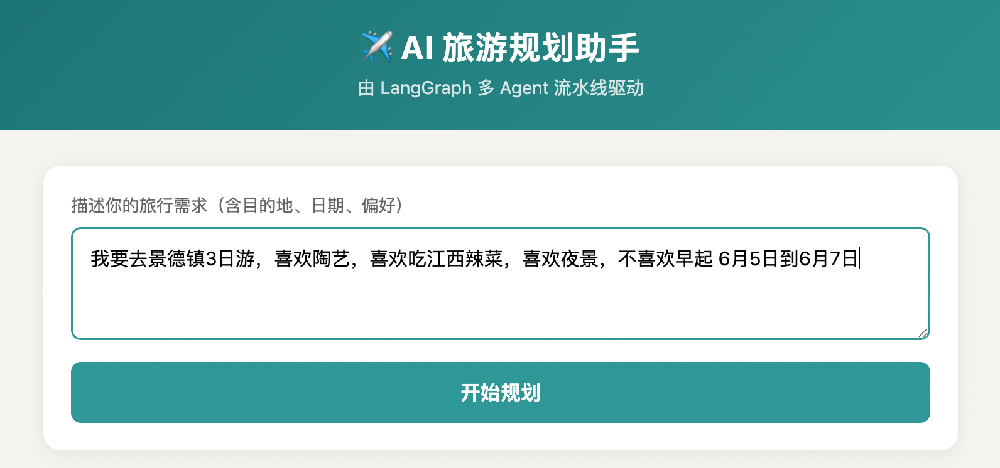

<div align="center">

# ✈️ AI 旅游规划助手

**一句话描述需求，自动生成带时刻表的多日旅游计划**

[](https://www.python.org/)
[](https://fastapi.tiangolo.com/)
[](https://github.com/langchain-ai/langgraph)
[](LICENSE)

</div>

---

## 📖 简介

AI 旅游规划助手是一个基于 **LangGraph 多 Agent 流水线** 的旅游行程生成工具。只需输入一句话的出行需求（目的地、日期、偏好），系统即可自动完成：

- 🔍 **意图识别** — 从自然语言抽取目的地、日期、偏好；支持"明天开始3日游"等相对时间 + 天数表达式
- 🌤️ **天气感知** — 自动拉取出行日期天气预报，雨雪天优先安排室内景点，超出预报范围时降级提示
- 🗺️ **景点搜索** — 调用高德地图 API 获取真实景点候选池，按评分过滤
- 🧭 **智能规划** — Planner/Reviewer 多轮循环优化，共享对话记忆确保紧急问题优先修复
- 🍜 **餐饮推荐** — 基于每天动线搜索周边餐厅，按天并行调用 LLM 推荐午晚餐

所有景点与餐厅数据均来自**高德真实 POI**，不会凭空捏造地点。

---

## 🎬 演示

> 输入：`我要去景德镇3日游，喜欢陶艺，喜欢吃江西辣菜，喜欢夜景，不喜欢早起 6月5日到6月7日`

<p align="center">
  
</p>

---

## 🏗️ 架构

```
用户输入
   │
   ▼
[Intent Agent]  ──── 缺少目的地/日期 ──→  提示补充信息
   │
   ▼
[高德景点搜索]  ←── 多关键词 + 评分过滤
   │
   ▼
[Planner Agent] ──────────────────────────┐
   │                                      │
   ▼                                      │ 评审不通过 (最多 N 轮)
[Reviewer Agent] ─────────────────────────┘
   │ 通过
   ▼
[高德周边餐饮搜索]
   │
   ▼
[Meal Recommend Agent]
   │
   ▼
[Finalize]  →  含时刻表 + 餐厅 + 距离的完整行程
```

**技术栈**

| 层 | 技术 |
|---|---|
| 后端框架 | FastAPI + Uvicorn |
| Agent 编排 | LangGraph |
| LLM | DeepSeek（通过 LangChain OpenAI 兼容层） |
| 地图数据 | 高德地图 Web 服务 API |
| 前端 | 原生 HTML / CSS / JavaScript |

---

## 🚀 快速开始

### 1. 克隆仓库

```bash
git clone https://github.com/your-username/trip-agent.git
cd trip-agent
```

### 2. 安装依赖

```bash
pip install -r requirements.txt
```

### 3. 配置环境变量

```bash
cp .env.example .env.local
```

编辑 `.env.local`，填入你的 API Key：

```env
AMAP_API_KEY=your_amap_key        # 高德 Web 服务 Key（免费申请）
DEEPSEEK_API_KEY=your_deepseek_key # DeepSeek API Key
```

> **如何获取 Key？**
> - 高德 Key：登录 [高德开放平台](https://lbs.amap.com/) → 控制台 → 创建应用 → 添加 Web 服务 Key
> - DeepSeek Key：登录 [DeepSeek 开放平台](https://platform.deepseek.com/) → API Keys

### 4. 启动服务

```bash
python run.py
```

打开浏览器访问 **http://localhost:8765**，输入出行需求即可。

---

## ⚙️ 参数说明

`POST /api/plan` 接口支持以下参数：

| 参数 | 类型 | 默认值 | 说明 |
|---|---|---|---|
| `query` | string | 必填 | 一句话出行需求 |
| `max_per_day` | int | 3 | 每天最多景点数 |
| `min_rating` | float | 4.5 | 景点最低评分门槛 |
| `max_spots` | int | 30 | 候选景点池大小 |
| `max_review_rounds` | int | 3 | Planner-Reviewer 最大循环轮数 |

---

## 📁 项目结构

```
├── app/
│   ├── core/          # 环境变量加载、HTTP 工具
│   ├── llm/           # DeepSeek 客户端工厂
│   ├── providers/
│   │   ├── amap/      # 高德地图 POI 搜索
│   │   └── weather/   # 高德天气预报
│   └── planning/
│       ├── schemas.py  # Pydantic 数据模型 & LangGraph 状态
│       ├── nodes.py    # 各 Agent 节点函数
│       ├── graph.py    # LangGraph 图构建与流水线入口
│       ├── helpers.py  # 纯工具函数（地理计算、评审预检等）
│       └── prompts.py  # 所有 LLM System Prompt
├── frontend/          # 静态前端（HTML/CSS/JS）
├── run.py             # 启动入口
└── .env.example       # 环境变量模板
```

---

## 🔑 设计亮点

**1. 候选池封闭世界约束**
所有景点必须来自高德 API 搜索结果，LLM 不得凭空生成景点名。Reviewer Agent 有硬性检查，出现非候选池景点直接打回重规划。

**2. 代码评审 + LLM 评审分层**
Reviewer 的判断依据由 Python 预先计算（每天地理跨度、开放时间冲突检测），以客观事实形式喂给 LLM，避免纯 LLM 评审的幻觉风险。

**3. Planner-Reviewer 共享对话记忆**
每轮规划双方各追加一条记录到 `planner_reviewer_dialogue`。Reviewer 凭此记住自己上轮标注的【紧急必须优先改】是否已被响应，避免每轮从零审视导致的低效循环；Planner 也能对照哪些意见已修复、哪些紧急问题仍待解决。

**4. 天气感知路线规划**
Intent 阶段自动拉取高德天气预报（复用已有 `AMAP_API_KEY`），将天气信息注入 Planner 和 Reviewer 的 prompt。雨雪天 Planner 会优先安排博物馆、展馆等室内景点，Reviewer 也会检查路线是否与天气矛盾并打回修改。超出预报范围（约 4 天）时降级提示，不中断规划流程。

**5. 餐饮推荐按天并行 + 确定性降级**
将原本"所有天一次 LLM 调用"改为每天独立调用（`SingleDayMealPick`，4 字段），不同天用线程池并行执行，单天 LLM 失败时自动降级取评分最高餐厅，不影响其他天，彻底消除因 prompt 过长导致的 500 错误。

**6. 结构化输出防护**
所有 LLM 调用通过 `invoke_structured` 包装，对 DeepSeek function calling 偶发返回 `None` 的情况自动重试，保证流水线稳定。

---

## 📄 License

[MIT](LICENSE)
