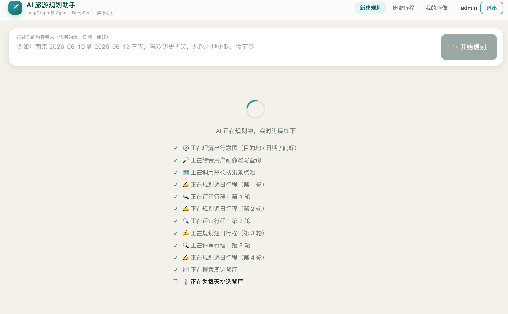
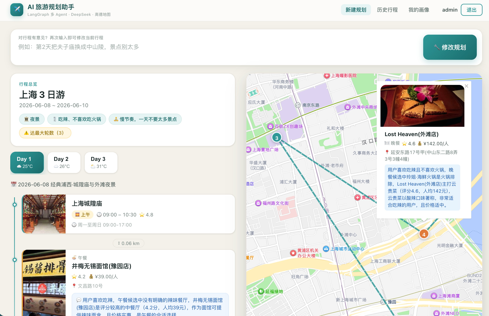
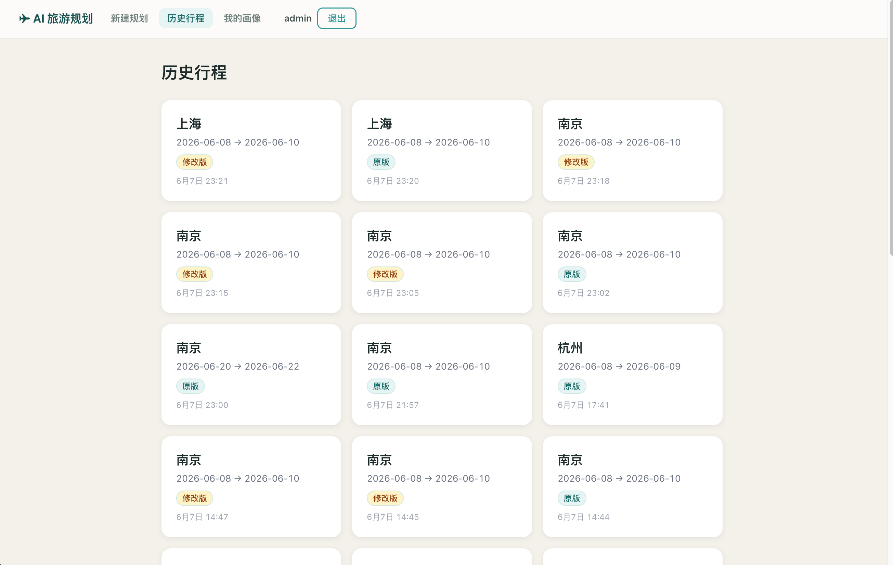
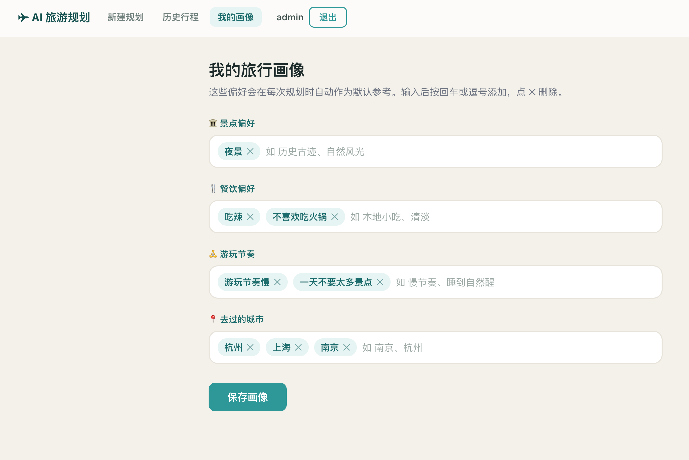

# ✈️ AI 旅游规划助手

**一句话描述需求，自动生成带时刻表的多日旅游计划**

[](https://www.python.org/)
[](https://fastapi.tiangolo.com/)
[](https://github.com/langchain-ai/langgraph)
[](tests/EVAL_GUIDE.md)
[](LICENSE)

</div>


---

## 📖 简介

AI 旅游规划助手是一个基于 **LangGraph 多 Agent 流水线** 的旅游行程生成工具。只需输入一句话的出行需求（目的地、日期、偏好），系统即可自动完成：

- 🔍 **意图识别（快速失败）** — 从自然语言抽取目的地、日期、偏好；支持"明天开始3日游"等相对时间 + 天数表达式；缺目的地/日期时立即返回，不触发后续 LLM 调用
- 🌤️ **天气感知** — 自动拉取出行日期天气预报，雨雪天优先安排室内景点，超出预报范围时降级提示
- 🗺️ **景点搜索** — 调用高德地图 API 获取真实景点候选池，按评分过滤
- 🧭 **智能规划** — Planner/Reviewer 多轮循环优化，共享对话记忆确保紧急问题优先修复
- 🍜 **餐饮推荐** — 基于每天动线搜索周边餐厅，按天并行调用 LLM 推荐午晚餐
- 🗺️ **地图可视化** — 前端接入高德 JS API，在半屏地图上逐天绘制行程动线与景点标注

所有景点与餐厅数据均来自**高德真实 POI**，不会凭空捏造地点。

> 🧪 **这个项目有Agent评测体系**：基于 Anthropic《Demystifying Evals for AI Agents》方法论，对核心 Agent（Planner / Reviewer）建立了可复现的定量评估框架，包括代码打分器 G1–G7 + LLM 评委 + Reviewer 可靠性指标，指标覆盖 pass@k、pass^k、收敛轮次、误放行率、planner 反驳率。详见 [`tests/EVAL_GUIDE.md`](tests/EVAL_GUIDE.md)。

---

## 🎬 演示

> 输入：`明天开始上海3日游`

<p align="center">
  
</p>

> 规划详情页

<p align="center">
  
</p>

> 历史规划页

<p align="center">
  
</p>

> 我的画像

<p align="center">
  
</p>


---

## 🏗️ 架构

```
用户输入
   │
   ▼
[Intent Agent]  ──── 缺少目的地/日期 ──→  提示补充信息（快速失败，无额外 LLM 成本）
   │
   ▼
[Query Rewrite]  ←── 直接读 DB 画像，单次 LLM 改写 + 冲突解析（登录用户专属）
   │
   ▼
[高德景点搜索]  ←── 多关键词 + 评分过滤
   │
   ▼
[Planner Agent] ──────────────────────────┐
   │                                      │
   ▼                                      │ 评审不通过 (最多 N 轮)
[Reviewer Agent] ─────────────────────────┘
   │ 通过
   ▼
[高德周边餐饮搜索]
   │
   ▼
[Meal Recommend Agent]
   │
   ▼
[Finalize]  →  含时刻表 + 餐厅 + 距离的完整行程
```

**修改规划（迷你图）**：用户对已有行程提修改意见时，跳过 Intent/景点搜索，从上次规划的 checkpoint 恢复状态，只跑 `Planner ⇄ Reviewer（最多 2 轮）→ 餐饮 → Finalize`，Reviewer 验证 Planner 是否真正响应了修改意见。

**技术栈**


| 层        | 技术                                |
| -------- | --------------------------------- |
| 后端框架     | FastAPI + Uvicorn                 |
| Agent 编排 | LangGraph                         |
| LLM      | DeepSeek（通过 LangChain OpenAI 兼容层） |
| 地图数据     | 高德地图 Web 服务 API                   |
| 前端       | 原生 HTML / CSS / JavaScript        |


---

## 🚀 快速开始

### 1. 克隆仓库

```bash
git clone https://github.com/your-username/trip-agent.git
cd trip-agent
```

### 2. 安装依赖

```bash
pip install -r requirements.txt
```

### 3. 配置环境变量

```bash
cp .env.example .env.local
```

编辑 `.env.local`，填入你的 API Key：

```env
AMAP_API_KEY=your_amap_key             # 高德 Web 服务 Key（必填，景点/天气）
DEEPSEEK_API_KEY=your_deepseek_key     # DeepSeek API Key（必填）
AMAP_JS_KEY=your_amap_js_key           # 高德 JS API Key（可选，前端地图）
AMAP_JS_SECURITY_CODE=your_js_secret   # 高德 JS API 安全密钥（可选，与 JS Key 配套）
```

> **如何获取 Key？**
>
> - 高德 Web 服务 Key：登录 [高德开放平台](https://lbs.amap.com/) → 控制台 → 创建应用 → 添加 **Web 服务** Key
> - 高德 JS API Key：同一应用下再添加一个 **Web 端 (JS API)** Key，并配置安全密钥 `securityJsCode`（前端地图可视化用，不填则地图区域降级提示）
> - DeepSeek Key：登录 [DeepSeek 开放平台](https://platform.deepseek.com/) → API Keys

### 4. 启动服务

```bash
python run.py
```

打开浏览器访问 **[http://localhost:8765](http://localhost:8765)**，输入出行需求即可。

---

## 📁 项目结构

```
├── app/
│   ├── core/          # 环境变量加载、HTTP 工具
│   ├── llm/           # DeepSeek 客户端工厂
│   ├── providers/
│   │   ├── amap/      # 高德地图 POI 搜索
│   │   └── weather/   # 高德天气预报
│   └── planning/
│       ├── schemas.py  # Pydantic 数据模型 & LangGraph 状态
│       ├── nodes.py    # 各 Agent 节点函数
│       ├── graph.py    # LangGraph 图构建与流水线入口
│       ├── helpers.py  # 纯工具函数（地理计算、评审预检等）
│       └── prompts.py  # 所有 LLM System Prompt
├── tests/
│   ├── EVAL_GUIDE.md              # 评估框架使用手册
│   ├── eval/                      # Planner/Reviewer 评估框架
│   │   ├── harness.py             # fixture → TravelPlanState → mini-graph
│   │   ├── run_eval.py            # 主入口：加载用例 → k 次评估 → 报告
│   │   ├── report.py              # 指标聚合与 Markdown 报告
│   │   ├── capture_pool.py        # 调高德 API 抓真实景点池骨架
│   │   ├── generate_fixtures.py   # 批量生成测试 fixture
│   │   └── graders/
│   │       ├── code_graders.py    # G1–G7 确定性代码打分器
│   │       ├── llm_judge.py       # LLM 评委（主观维度打分）
│   │       └── reviewer_reliability.py  # Reviewer 可靠性 + Planner 反驳率
│   ├── eval_query_rewrite/        # query_rewrite 节点专项评估
│   │   ├── fixtures.py            # 5 个测试场景（补全/冲突/不发明）
│   │   ├── harness.py             # 直接读 DB + 单次 LLM 调用 + 确定性打分
│   │   └── run_eval.py            # 评估入口：--only / --k / --out
│   └── test_weather_mock.py       # 雨天 mock 冒烟测试
├── frontend/          # 静态前端（HTML/CSS/JS）
├── run.py             # 启动入口
└── .env.example       # 环境变量模板
```

---

## 🔑 设计亮点

**1. 候选池封闭世界约束**
所有景点必须来自高德 API 搜索结果，LLM 不得凭空生成景点名。Reviewer Agent 有硬性检查，出现非候选池景点直接打回重规划。

**2. 代码评审 + LLM 评审分层**
Reviewer 的判断依据由 Python 预先计算（每天地理跨度、开放时间冲突检测），以客观事实形式喂给 LLM，避免纯 LLM 评审的幻觉风险。

**3. Planner-Reviewer 共享对话记忆**
每轮规划双方各追加一条记录到 `planner_reviewer_dialogue`。Reviewer 凭此记住自己上轮标注的【紧急必须优先改】是否已被响应，避免每轮从零审视导致的低效循环；Planner 也能对照哪些意见已修复、哪些紧急问题仍待解决。

**4. 天气感知路线规划**
Intent 阶段自动拉取高德天气预报（复用已有 `AMAP_API_KEY`），将天气信息注入 Planner 和 Reviewer 的 prompt。雨雪天 Planner 会优先安排博物馆、展馆等室内景点，Reviewer 也会检查路线是否与天气矛盾并打回修改。超出预报范围（约 4 天）时降级提示，不中断规划流程。

**5. 餐饮推荐按天并行 + 确定性降级**
将原本"所有天一次 LLM 调用"改为每天独立调用（`SingleDayMealPick`，4 字段），不同天用线程池并行执行，单天 LLM 失败时自动降级取评分最高餐厅，不影响其他天，彻底消除因 prompt 过长导致的 500 错误。

**6. 结构化输出防护**
所有 LLM 调用通过 `invoke_structured` 包装，对 DeepSeek function calling 偶发返回 `None` 的情况自动重试，保证流水线稳定。

**7. 前端地图动线可视化**
后端通过 `GET /api/config` 仅向前端下发高德 **JS API** 密钥（不暴露敏感的 REST `AMAP_API_KEY`），前端按天用高德地图绘制景点标注与连线动线，地图占据半屏，未配置 JS Key 时地图区域降级为友好提示，不影响行程文本展示。

---

## 🧪 评测体系

> **为什么信任这个系统的输出质量？**

本项目参照 Anthropic《Demystifying Evals for AI Agents》的方法论，对 Planner 和 Reviewer 两个核心 Agent 建立了一套**可复现的定量评估框架**。

### 评估设计

```
冻结输入（fixture）           真实 LLM 调用
 景点池 + 天气              Planner ⇄ Reviewer
    │                            │
    └──── mini-graph ────────────┘
                │
           最终 route
                │
     ┌──────────┴──────────┐
     ▼                     ▼
代码打分器 G1–G7        LLM 评委（主观维度）
（确定性，零 LLM 成本）   （偏好/节奏/天气适配）
```

- **输入冻结**：每个测试用例（fixture）冻结了景点候选池和天气，跳过 intent / 高德搜索，使评估可复现、零额外 API 成本
- **代码打分器 G1–G7**：复用代码（`helpers.py`）对最终路线做确定性校验，涵盖封闭池、开放时间、地理跨度、结构合法性、天气合规等
- **LLM 评委**：对主观质量（偏好贴合、节奏、动线连贯、天气应对策略）打 1–5 分
- **Reviewer 可靠性**：统计误放行率（放过坏方案）和误打回率（拒绝好方案），量化 Reviewer Agent 本身的判断质量
- **Planner 反驳率**：逐轮分析 Planner 对 Reviewer 意见的响应（采纳 / 反驳 / 忽略），忽略率高是 pass 率低的强信号

### 核心指标

| 指标 | 含义 |
|---|---|
| **pass@k** | k 次中≥1 次客观通过且收敛（能力下界） |
| **pass^k** | k 次全部通过（稳定性） |
| **轮次均值** | 平均用几轮收敛，目标 ≤ 3 |
| **误放行率** | Reviewer 放过不合格方案的概率，理想接近 0% |
| **忽略率** | Planner 对 Reviewer 意见不改也不解释，越低越好 |

### 快速运行

```bash
# 单用例冒烟（不调 LLM 评委，省钱）
python -m tests.eval.run_eval --only nanjing-3d-sunny-history --k 1 --no-judge

# 标准评估（k=5，输出 Markdown 报告）
python -m tests.eval.run_eval --k 5 --out eval_report.md
```

详细说明见 [`tests/EVAL_GUIDE.md`](tests/EVAL_GUIDE.md)。

### query_rewrite 节点专项评估

针对 `query_rewrite` 节点的行为验证，独立于 Planner/Reviewer 评估框架，位于 `tests/eval_query_rewrite/`。

**测试的三个核心行为：**

| 指标 | 含义 |
|---|---|
| **g_supplement** | query 无偏好时，应从历史画像补全对应字段 |
| **g_conflict** | query 与画像冲突时（如"不吃辣" vs 画像"辣味美食"），以 query 为准 |
| **g_no_invention** | query 和画像均无偏好时，三字段应为 null，不凭空编造 |

**5 个 fixture 覆盖场景：**`no-pref-supplement` / `conflict-food-query-wins` / `partial-merge` / `empty-profile` / `no-pref-both`

```bash
# 单用例冒烟（最快）
python -m tests.eval_query_rewrite.run_eval --only conflict-food-query-wins

# 全量 5 用例
python -m tests.eval_query_rewrite.run_eval

# 稳定性（每用例跑 3 次）
python -m tests.eval_query_rewrite.run_eval --k 3 --out qr_eval_report.md
```

---

## 📄 License

[MIT](LICENSE)